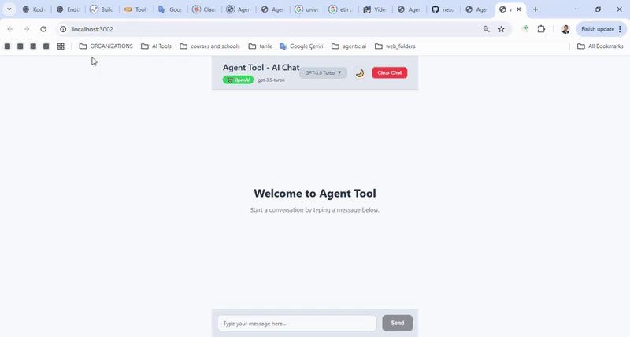

# 🎬 NEXUS CHAT - DEMO GIF OLUŞTURMA REHBERİ

## 🔥 HEMEN ŞİMDİ YAP!

### 1️⃣ DEMO KAYDI (15-20 saniye)

**🌐 URL**: http://localhost:3002

**📋 SENARYO**:
```
⏰ 0-3s   → Dark tema'da "Hello! Can you help me?" yaz ve gönder
⏰ 4-6s   → ☀️ butonuna tıkla (Light tema'ya geç - mavi tonları göster)
⏰ 7-9s   → Model dropdown aç → GPT-4 seç
⏰ 10-15s → "Show me a React component example" yaz ve gönder
⏰ 16-18s → AI yanıtını bekle (typing indicator göster)
⏰ 19-20s → Code block'ın syntax highlighting'ini göster
```

### 2️⃣ KAYIT YÖNTEMİ

**Windows Game Bar (En Kolay):**
1. **Windows + G** → Kayıt başlat
2. Demo senaryosunu uygula
3. **Windows + Alt + R** → Kayıt durdur

**Alternatif:**
- ScreenToGif (Ücretsiz): https://www.screentogif.com/
- OBS Studio (Profesyonel)

### 3️⃣ GIF DÖNÜŞTÜRME

**Online (Kolay):**
1. https://ezgif.com/video-to-gif
2. MP4'ü upload et
3. **Settings:**
   - Size: 1024x768 veya 800x600
   - FPS: 12-15
   - Colors: 256
4. Convert & Download

### 4️⃣ FİLE PLACEMENT

```bash
# Ana dizine koy
demo.gif  # ← BURAYA!

# Git'e ekle
git add demo.gif README.md
git commit -m "Add real demo GIF - shows theme switching and AI chat"
git push
```

## 🎯 ÖNEMLİ NOTLAR:

- **Dosya boyutu**: Max 10MB (GitHub limit)
- **Kalite**: 1024x768 çözünürlük ideal
- **Süre**: 15-20 saniye (çok uzun olmasın)
- **Loop**: Sonsuz döngü olsun
- **Dosya adı**: Kesinlikle `demo.gif`

## ✅ CHECKLIST:

- [ ] localhost:3002 açık
- [ ] Demo senaryosu hazır
- [ ] Kayıt aracı seçili
- [ ] 15-20 saniye plan
- [ ] GIF converter hazır
- [ ] Ana dizine koyma planı

## 🚀 SONUÇ:

Tamamlandığında README.md'de şu görünecek:
```markdown

```

**ŞİMDİ BAŞLA! 🎬**