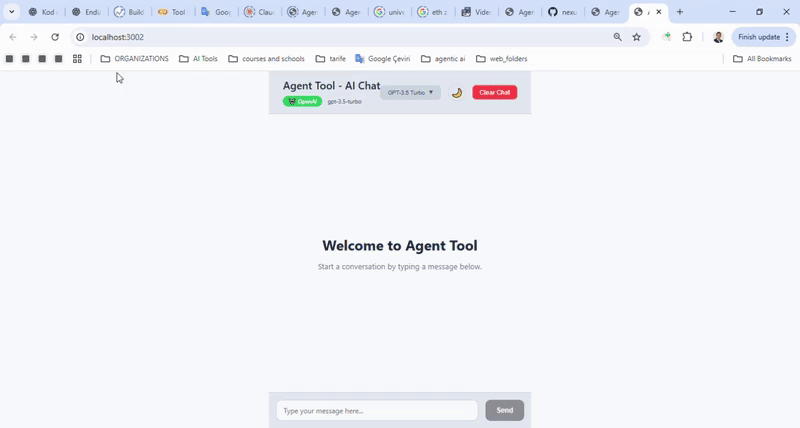

# 🎬 Demo GIF Oluşturma Rehberi

## 🔧 Hızlı Yöntem - Windows Game Bar

1. **Windows + G** tuşlarına basın (Game Bar açılır)
2. **Kayıt** butonuna tıklayın (🔴)
3. **Demo senaryosunu** uygulayın:
   ```
   ⏱️ 0-3s:   Dark tema'da "Hello" mesajı gönder
   ⏱️ 4-6s:   ☀️ butonuna tıkla (Light tema)
   ⏱️ 7-10s:  Model dropdown → GPT-4 seç
   ⏱️ 11-15s: "Can you show me some code?" gönder
   ⏱️ 16-20s: AI yanıtını bekle ve göster
   ```
4. **Kayıt durdur** (Windows + Alt + R)
5. Video **MP4** olarak kaydedilir

## 🎞️ MP4'ü GIF'e Çevirme

### Online Converter (Kolay):
1. https://ezgif.com/video-to-gif adresine git
2. MP4 dosyasını upload et
3. **Size**: 800x600 veya 1024x768
4. **FPS**: 10-15 (dosya boyutu için)
5. **Convert to GIF** tıkla
6. İndir ve `demo.gif` olarak kaydet

### FFmpeg (Profesyonel):
```bash
# Eğer ffmpeg yüklüyse
ffmpeg -i demo.mp4 -vf "fps=10,scale=1024:-1" demo.gif
```

## 📍 Demo Yerleştirme

1. **demo.gif** dosyasını **ana dizin**e koy
2. README.md'yi güncelle:
   ```markdown
   
   ```
3. Git'e ekle:
   ```bash
   git add demo.gif
   git commit -m "Add demo GIF"
   git push
   ```

## 🎯 Demo Senaryosu Detayları

### Başlangıç:
- Dark tema açık
- "GPT-3.5 Turbo" seçili
- Temiz chat ekranı

### Akış:
1. **Mesaj**: "Hello! Can you help me?"
2. **Tema değiş**: Light mode (mavi tonları göster)
3. **Model değiş**: GPT-4 seç
4. **Code isteği**: "Show me a React component example"
5. **Sonuç**: Code syntax highlighting göster

### Süre: **15-20 saniye** ideal